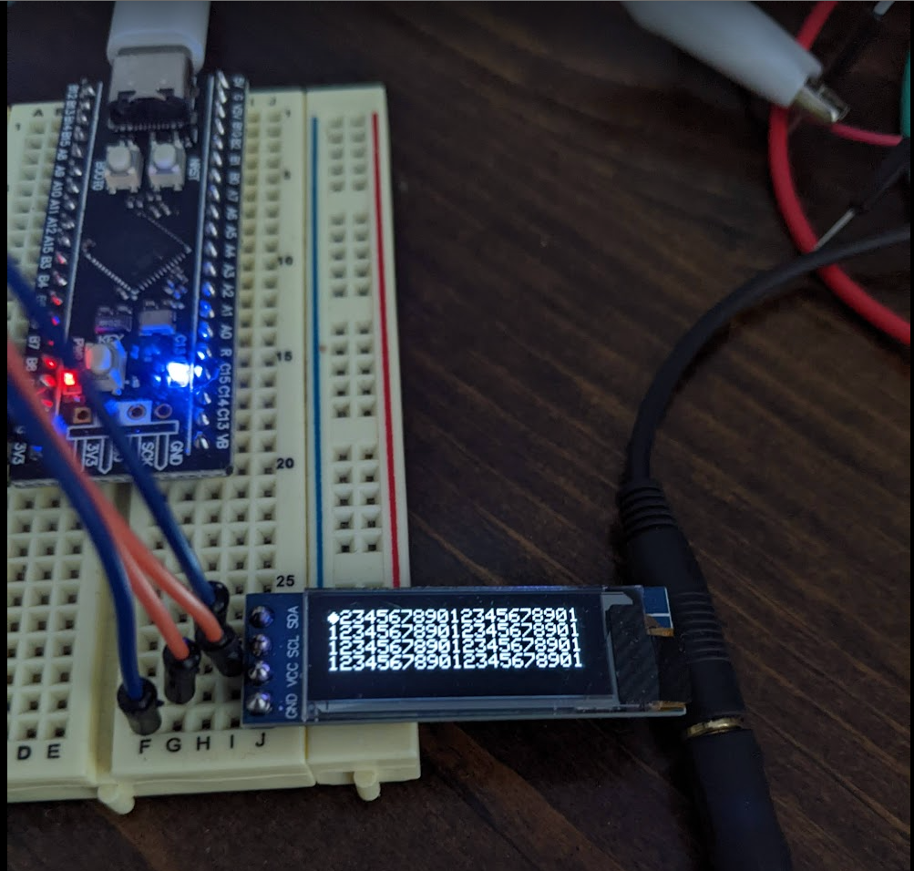

# qmk-hid-com

## Overview
A simple, small, user-space application to communicate with QMK firmware as a HID device

## Background
- Motivation: other solutions require python or nodejs installations (that do not come pre-installed on Windows), large dependencies (~10-100's of MB) to communicate with QMK

- This is a proof-of-concept for communication between C# application and QMK firmware

- I used an STM32 blackpill board (STM32F411CEU6) for this project

- In this example, the app prints CPU and memory utilization on SSD1306 OLED (4 lines/rows, 21 characters/columns)

- Uses https://github.com/mikeobrien/HidLibrary for discovering HID devices and sending data

<p>
  
</p>
Pictured above: filling the screen with data

## Method

1. Uses kind of a push-pull method to send data back and forth. App sends data to firmware, firmware sends data to app, repeat

2. The first byte the firmware sends is an index that represents the line number on the screen that it is requesting

3. Once four lines have been sent, the process repeats - the index is reset back to 0


## QMK code
I have this code in `keymap.c`:
```C
#ifdef RAW_ENABLE
// extra null byte at the end is required to display properly
#define SERIAL_SCREEN_BUFFER_LENGTH (/*SSD1306_MatrixCols*/21 * /*SSD1306_MatrixRows*/4 + /*Extra IsEnabledBit*/1)
uint8_t screen_data_buffer[SERIAL_SCREEN_BUFFER_LENGTH] = {0};
static int screen_data_index = 0;

// bytes to and from the host (32 on LUFA/ChibiOS/V-USB, 64 on ATSAM).
void raw_hid_receive(uint8_t *data, uint8_t length) {
    // a line to display on the screen
    if (length >= 21) {
        if (screen_data_index < 4) {
            memcpy((char*)&screen_data_buffer[screen_data_index * 21], data, 21);
            screen_data_index++;
        }
        else {
            oled_write_P((char*)screen_data_buffer, false);
            screen_data_index = 0;
        }
    }
    // send a response to keep communication flowing
    uint8_t send_data[32] = {screen_data_index, length, screen_data_buffer[0], screen_data_buffer[1]};
    raw_hid_send(send_data, sizeof(send_data));
}
#endif
```
